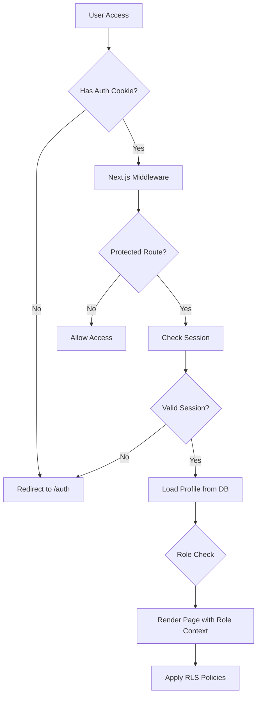

# Arquitetura Brownfield - Confraria Pedra Branca

**Versão**: 1.1
**Data**: 2026-01-27 (atualizado)
**Arquiteto**: Aria (AIOS Architect Agent)
**Status**: ✅ Análise Completa + Feature 9 Implementada

---

## 📋 Sumário Executivo

Este documento apresenta a análise arquitetural completa do sistema **Confraria Pedra Branca**, um sistema de gestão de consórcios construído com Next.js 14 e Supabase. O sistema está em **produção na branch Ver-26** e gerencia grupos de consórcios, membros, cotas e sorteios.

### Contexto do Projeto
- **Tipo**: Sistema SaaS B2B para gestão de consórcios
- **Estado Atual**: Em produção (branch: Ver-26)
- **Análise**: Brownfield (código existente + expansões implementadas)
- **Última Implementação**: Feature 9 - Transações de Negócios (2026-01-27)
- **Próximas Fases**: Implementação de 18 User Stories remanescentes (área gerencial expandida)

---

## 🏗️ Visão Geral da Arquitetura

### Stack Tecnológica

#### Frontend
| Camada | Tecnologia | Versão | Propósito |
|--------|-----------|--------|-----------|
| **Framework** | Next.js | 14.2.21 | SSR/SSG + App Router |
| **React** | React | 18.3.1 | UI Library |
| **Linguagem** | TypeScript | 5.8.3 | Type Safety |
| **Estilização** | Tailwind CSS | 3.4.17 | Utility-first CSS |
| **Componentes UI** | shadcn/ui + Radix UI | Latest | Design System |
| **Animações** | Framer Motion | 11.15.0 | Animações fluidas |
| **State Management** | TanStack Query | 5.83.0 | Server State |
| **Form Handling** | React Hook Form | 7.61.1 | Formulários |
| **Validation** | Zod | 3.25.76 | Schema validation |
| **Date Handling** | date-fns | 3.6.0 | Manipulação de datas |
| **Charts** | Recharts | 2.15.4 | Gráficos e dashboards |
| **Icons** | Lucide React | 0.462.0 | Ícones |
| **Carousel** | Embla Carousel | 8.6.0 | Carrosséis |
| **Theme** | next-themes | 0.3.0 | Dark mode support |
| **Toast** | Sonner | 1.7.4 | Notificações |

#### Backend & Database
| Camada | Tecnologia | Versão | Propósito |
|--------|-----------|--------|-----------|
| **BaaS** | Supabase | 2.58.0 | Backend completo |
| **Database** | PostgreSQL | Latest (via Supabase) | Banco relacional |
| **Auth** | Supabase Auth | Latest | Autenticação JWT |
| **Storage** | Supabase Storage | Latest | Armazenamento de arquivos |
| **Realtime** | Supabase Realtime | Latest | WebSocket subscriptions |
| **API** | Supabase SSR | 0.5.2 | Server-side rendering |

#### DevOps & Deployment
| Camada | Tecnologia | Propósito |
|--------|-----------|-----------|
| **Hosting** | Netlify + Vercel | Deploy frontend |
| **CI/CD** | Netlify Plugin | Build automation |
| **Version Control** | Git + GitHub | Repositório |
| **Branch Strategy** | Ver-26 (testing) | Deploy staging |
| **Linting** | ESLint | Code quality |
| **Package Manager** | npm | Gerenciamento deps |

---

## 🗄️ Arquitetura de Dados

### Schema do Banco de Dados

```
┌─────────────────┐
│   auth.users    │ (Supabase Auth)
│   - id (uuid)   │
│   - email       │
└────────┬────────┘
         │ 1:1
         │
┌────────▼─────────────────┐
│      profiles           │
│   - id (uuid) PK/FK     │
│   - full_name           │
│   - phone (unique)      │
│   - role (enum)         │ ◄──┐
│   - address_*           │    │
│   - instagram           │    │
│   - pre_registered      │    │
└─────────────────────────┘    │
         │                     │
         │ 1:N                 │ N:M
         ▼                     │
┌─────────────────────────┐    │
│   member_companies      │────┘
│   - member_id (FK)      │
│   - company_id (FK)     │
└────────┬────────────────┘
         │
         │ N:1
         ▼
┌─────────────────────────┐
│      companies          │
│   - id (uuid) PK        │
│   - name                │
│   - cnpj (unique)       │
│   - address_*           │
│   - phone               │
│   - instagram           │
│   - description         │
└─────────────────────────┘

┌─────────────────────────┐
│       groups            │
│   - id (uuid) PK        │
│   - name (unique)       │
│   - description         │
│   - asset_value         │
│   - total_quotas        │
│   - monthly_value       │
│   - adjustment_type     │
│   - adjustment_value    │
│   - is_active           │
└────────┬────────────────┘
         │
         │ 1:N
         ▼
┌─────────────────────────┐
│       quotas            │
│   - id (uuid) PK        │
│   - group_id (FK)       │
│   - member_id (FK)      │
│   - quota_number        │
│   - status (enum)       │
└────────┬────────────────┘
         │
         │ 1:N
         ▼
┌─────────────────────────┐
│        draws            │
│   - id (uuid) PK        │
│   - group_id (FK)       │
│   - winning_quota_id    │
│   - winning_number      │
│   - drawn_numbers[]     │
│   - winner_position     │
│   - draw_date           │
│   - deleted_at          │
└─────────────────────────┘
```

### Regras de Cascata

| Tabela Pai | Ação | Tabela Filha | Comportamento |
|-----------|------|-------------|---------------|
| `auth.users` | DELETE | `profiles` | CASCADE |
| `profiles` | DELETE | `member_companies` | SET NULL |
| `companies` | DELETE | `member_companies` | CASCADE |
| `groups` | DELETE | `quotas` | CASCADE |
| `groups` | DELETE | `draws` | CASCADE |
| `quotas` | DELETE | `draws` | SET NULL |

### Indexes Criados (Performance)

```sql
-- profiles
idx_profiles_phone
idx_profiles_role

-- companies
idx_companies_cnpj
idx_companies_name

-- groups
idx_groups_is_active
idx_groups_name

-- quotas
idx_quotas_group_id
idx_quotas_member_id
idx_quotas_status

-- draws
idx_draws_group_id
idx_draws_draw_date
```

---

## 🔐 Arquitetura de Segurança

### Row Level Security (RLS)

#### Tabela: `profiles`
| Operação | Política | Condição |
|----------|---------|----------|
| SELECT | "Users can view own profile" | `auth.uid() = id` |
| SELECT | "Admins can view all profiles" | `role = 'admin'` |
| UPDATE | "Users can update own profile" | `auth.uid() = id` |
| UPDATE | "Admins can update all profiles" | `role = 'admin'` |

#### Tabela: `companies`
| Operação | Política | Condição |
|----------|---------|----------|
| SELECT | "Authenticated users can view" | `authenticated` |
| INSERT/UPDATE/DELETE | "Admins only" | `role = 'admin'` |

#### Tabela: `groups`
| Operação | Política | Condição |
|----------|---------|----------|
| SELECT | "Authenticated can view active" | `is_active = true` |
| SELECT | "Admins can view all" | `role = 'admin'` |
| INSERT/UPDATE/DELETE | "Admins only" | `role = 'admin'` |

#### Tabela: `quotas`
| Operação | Política | Condição |
|----------|---------|----------|
| SELECT | "Members can view own quotas" | `member_id = auth.uid()` |
| SELECT | "Admins can view all" | `role = 'admin'` |
| INSERT/UPDATE/DELETE | "Admins only" | `role = 'admin'` |

### Fluxo de Autenticação



### Autenticação - Implementação

#### Middleware (Edge Runtime)
**Arquivo**: `middleware.ts`
- **Tecnologia**: Next.js Edge Middleware
- **Responsabilidade**: Verificação inicial de cookies de auth
- **Otimização**: Simplified check (não faz queries ao DB)

```typescript
// Verifica presença de cookies Supabase
const hasAuthCookie = request.cookies.getAll().some(
  (cookie) => cookie.name.includes('auth-token') || cookie.name.includes('sb-')
)
```

#### Layout Protegido (Server Component)
**Arquivo**: `app/(protected)/layout.tsx`
- **Tecnologia**: React Server Component
- **Responsabilidade**: Validação completa da sessão + carregamento de perfil

```typescript
const supabase = await createClient()
const { data: { session } } = await supabase.auth.getSession()

if (!session) {
  redirect('/auth')
}

// Carrega role do usuário
const { data: profileData } = await supabase
  .from('profiles')
  .select('role')
  .eq('id', session.user.id)
  .single()
```

#### Client-Side Role Check
**Arquivo**: `hooks/use-admin.tsx`
- **Tecnologia**: React Hook + Supabase Client
- **Responsabilidade**: Verificação de role em componentes cliente

---

## 🏛️ Padrões Arquiteturais

### 1. Server-Side Rendering (SSR)

**Padrão**: Next.js 14 App Router com React Server Components (RSC)

**Implementação**:
- **Layouts**: Server Components por padrão
- **Pages**: Server Components por padrão
- **Client Components**: Marcados explicitamente com `'use client'`

**Benefícios**:
- ✅ SEO otimizado
- ✅ Performance inicial melhor
- ✅ Redução de JavaScript no cliente
- ✅ Acesso direto ao banco de dados

**Arquivos Chave**:
- `app/(protected)/layout.tsx` - Layout server-side
- `lib/supabase/server.ts` - Supabase client para SSR

### 2. Client Components Strategy

**Quando usar Client Components**:
- Interatividade (onClick, onChange, etc.)
- Hooks do React (useState, useEffect, etc.)
- Browser APIs (localStorage, window, etc.)
- TanStack Query (React Query)

**Padrão Atual**:
```typescript
// ✅ Bom: Server Component delega interatividade
// app/(protected)/groups/page.tsx
export default async function GroupsPage() {
  const supabase = await createClient()
  const { data } = await supabase.from('groups').select('*')

  return <GroupsPageClient groups={data} /> // Client Component
}
```

### 3. API Route Handlers

**Padrão**: Next.js Route Handlers para operações complexas

**Quando usar**:
- Lógica de negócio complexa
- Múltiplas operações no banco
- Geração de dados (ex: sorteios)
- Operações que exigem validação adicional

**Estrutura**:
```
app/api/
  ├── members/route.ts      # GET, POST
  ├── members/[id]/route.ts # GET, PATCH, DELETE
  ├── companies/route.ts
  ├── draws/[groupId]/
  │   ├── route.ts          # GET draws
  │   └── execute/route.ts  # POST execute draw
```

**Padrão de Implementação**:
```typescript
// 1. Verificar autenticação
const { data: { session } } = await supabase.auth.getSession()
if (!session) return NextResponse.json({ error: 'Unauthorized' }, { status: 401 })

// 2. Verificar autorização (role)
const { data: profileData } = await supabase
  .from('profiles')
  .select('role')
  .eq('id', session.user.id)
  .single()

if (adminProfile?.role !== 'admin') {
  return NextResponse.json({ error: 'Forbidden' }, { status: 403 })
}

// 3. Executar operação
```

### 4. Form Handling Pattern

**Stack**: React Hook Form + Zod + Server Actions

**Fluxo**:
```typescript
// 1. Definir schema Zod (lib/schemas.ts)
export const companySchema = z.object({
  name: z.string().min(2).max(200),
  cnpj: z.string().regex(/^\d{2}\.\d{3}\.\d{3}\/\d{4}-\d{2}$/),
  // ...
})

// 2. Criar formulário com React Hook Form
const form = useForm<z.infer<typeof companySchema>>({
  resolver: zodResolver(companySchema),
  defaultValues: { ... }
})

// 3. Submit via API Route ou Server Action
const onSubmit = async (data) => {
  const response = await fetch('/api/companies', {
    method: 'POST',
    body: JSON.stringify(data)
  })
}
```

### 5. State Management Pattern

**Server State**: TanStack Query (React Query)

**Uso**:
- Cache de dados do Supabase
- Invalidação automática
- Optimistic updates
- Background refetching

**Exemplo**:
```typescript
// hooks/use-members.ts
export function useMembers() {
  return useQuery({
    queryKey: ['members'],
    queryFn: async () => {
      const response = await fetch('/api/members')
      return response.json()
    }
  })
}

// Componente
const { data, isLoading, error } = useMembers()
```

**Client State**: React useState (local)

**Uso**:
- UI state (modals, dropdowns)
- Form state (React Hook Form)
- Component-specific state

### 6. Supabase Client Pattern

**Dois clientes distintos**:

#### Server Client (`lib/supabase/server.ts`)
```typescript
import { createServerClient } from '@supabase/ssr'
import { cookies } from 'next/headers'

export async function createClient() {
  const cookieStore = await cookies()
  return createServerClient<Database>(
    process.env.NEXT_PUBLIC_SUPABASE_URL!,
    process.env.NEXT_PUBLIC_SUPABASE_ANON_KEY!,
    {
      cookies: {
        getAll() { return cookieStore.getAll() },
        setAll(cookiesToSet) { /* ... */ }
      }
    }
  )
}
```

**Usar em**:
- Server Components
- Server Actions
- Route Handlers
- Middleware (com limitações)

#### Client Client (`lib/supabase/client.ts`)
```typescript
import { createBrowserClient } from '@supabase/ssr'

export function createClient() {
  return createBrowserClient<Database>(
    process.env.NEXT_PUBLIC_SUPABASE_URL!,
    process.env.NEXT_PUBLIC_SUPABASE_ANON_KEY!
  )
}
```

**Usar em**:
- Client Components
- React Hooks
- Browser-only code

---

## 📁 Estrutura de Diretórios

```
confraria/
├── app/
│   ├── (auth)/                   # Grupo de rotas públicas
│   │   ├── auth/
│   │   │   └── page.tsx          # Página de login
│   │   └── layout.tsx            # Layout público
│   │
│   ├── (protected)/              # Grupo de rotas protegidas
│   │   ├── layout.tsx            # Layout com Sidebar + Auth check
│   │   ├── dashboard/
│   │   │   └── page.tsx
│   │   ├── members/
│   │   │   ├── page.tsx
│   │   │   └── [id]/
│   │   │       └── page.tsx
│   │   ├── companies/
│   │   │   └── page.tsx
│   │   ├── groups/
│   │   │   ├── page.tsx
│   │   │   ├── new/
│   │   │   │   └── page.tsx
│   │   │   └── [id]/
│   │   │       ├── page.tsx
│   │   │       └── draw/
│   │   │           └── page.tsx
│   │   ├── profile/
│   │   │   └── page.tsx
│   │   └── pre-register/
│   │       └── page.tsx
│   │
│   ├── api/                      # API Route Handlers
│   │   ├── members/
│   │   │   ├── route.ts
│   │   │   └── [id]/
│   │   │       └── route.ts
│   │   ├── companies/
│   │   │   ├── route.ts
│   │   │   └── [id]/
│   │   │       └── route.ts
│   │   └── draws/
│   │       └── [groupId]/
│   │           ├── route.ts
│   │           └── execute/
│   │               └── route.ts
│   │
│   ├── layout.tsx                # Root layout
│   ├── page.tsx                  # Home page
│   ├── globals.css               # Estilos globais
│   └── not-found.tsx
│
├── components/
│   ├── ui/                       # shadcn/ui components
│   │   ├── button.tsx
│   │   ├── card.tsx
│   │   ├── dialog.tsx
│   │   ├── form.tsx
│   │   ├── input.tsx
│   │   ├── select.tsx
│   │   ├── table.tsx
│   │   └── ...
│   │
│   ├── draw/
│   │   └── DrawMachine.tsx       # Componente de sorteio
│   │
│   ├── companies/                # Feature-specific components
│   │   ├── CompaniesClient.tsx
│   │   ├── CompanyCard.tsx
│   │   ├── CompanyDetailModal.tsx
│   │   ├── CreateCompanyModal.tsx
│   │   ├── types.ts
│   │   └── index.ts
│   │
│   ├── icons/
│   │   └── Icon.tsx
│   │
│   ├── providers/
│   │   └── QueryProvider.tsx     # TanStack Query provider
│   │
│   └── Sidebar.tsx               # Sidebar component
│
├── hooks/
│   ├── use-admin.tsx             # Hook para verificar role admin
│   ├── use-members.ts            # React Query hook para members
│   ├── use-mobile.tsx            # Hook de responsividade
│   └── use-toast.ts              # Hook de notificações
│
├── lib/
│   ├── supabase/
│   │   ├── client.ts             # Cliente Supabase (browser)
│   │   ├── server.ts             # Cliente Supabase (server)
│   │   └── types.ts              # Database types gerados
│   │
│   ├── utils/
│   │   └── phone.ts              # Utilitários de telefone
│   │
│   ├── schemas.ts                # Zod schemas
│   └── utils.ts                  # Utilitários gerais (cn)
│
├── supabase/
│   ├── config.toml               # Configuração Supabase CLI
│   ├── migrations/               # Migrations SQL
│   │   ├── 20251001185004_create_initial_schema.sql
│   │   ├── 20251002170244_complete_database_schema.sql
│   │   └── ...
│   │
│   └── functions/                # Edge Functions (vazio)
│
├── public/
│   ├── icons/
│   └── images/
│
├── docs/                         # Documentação AIOS
│   ├── 01-REQUIREMENTS/
│   ├── 02-DESIGN/
│   ├── 03-ARCHITECTURE/
│   ├── 04-IMPLEMENTATION/
│   ├── 05-PROMPTS/
│   ├── 06-TESTING/
│   ├── 08-STORIES/
│   └── 99-REFERENCES/
│
├── middleware.ts                 # Next.js Edge Middleware
├── next.config.js
├── tailwind.config.ts
├── tsconfig.json
├── package.json
└── .env.local                    # Variáveis de ambiente
```

---

## 🔄 Fluxos de Dados Principais

### 1. Fluxo de Autenticação

```
┌─────────────┐
│   Browser   │
└──────┬──────┘
       │
       │ 1. Access /groups
       ▼
┌─────────────────────┐
│ Next.js Middleware  │
│ (Edge Runtime)      │
└──────┬──────────────┘
       │
       │ 2. Check Auth Cookie
       ▼
┌─────────────────────────────┐
│ Has cookie? → Continue      │
│ No cookie? → Redirect /auth │
└──────┬──────────────────────┘
       │
       │ 3. Render Server Component
       ▼
┌──────────────────────────────────┐
│ app/(protected)/layout.tsx       │
│ - createClient() [server]        │
│ - getSession()                   │
│ - Query profiles for role        │
└──────┬───────────────────────────┘
       │
       │ 4. Pass role to Sidebar
       ▼
┌────────────────────────────┐
│ Render Page with Context   │
│ - Role available           │
│ - RLS policies apply       │
└────────────────────────────┘
```

### 2. Fluxo de CRUD (Exemplo: Empresas)

```
┌────────────────┐
│ User clicks    │
│ "Nova Empresa" │
└────────┬───────┘
         │
         │ 1. Open Modal
         ▼
┌──────────────────────────────┐
│ CreateCompanyModal           │
│ - React Hook Form            │
│ - Zod validation (client)    │
└────────┬─────────────────────┘
         │
         │ 2. onSubmit
         ▼
┌──────────────────────────────┐
│ POST /api/companies          │
│ - Auth check (session)       │
│ - Role check (admin)         │
│ - Zod validation (server)    │
└────────┬─────────────────────┘
         │
         │ 3. Insert to DB
         ▼
┌──────────────────────────────┐
│ Supabase (Server Client)     │
│ - RLS policies apply         │
│ - Insert into companies      │
└────────┬─────────────────────┘
         │
         │ 4. Success Response
         ▼
┌──────────────────────────────┐
│ React Query                  │
│ - Invalidate ['companies']   │
│ - Refetch data               │
└────────┬─────────────────────┘
         │
         │ 5. UI Update
         ▼
┌──────────────────────────────┐
│ CompaniesClient              │
│ - New company appears        │
│ - Toast notification         │
└──────────────────────────────┘
```

### 3. Fluxo de Sorteio (Draw)

```
┌──────────────────┐
│ Admin clicks     │
│ "Realizar        │
│  Sorteio"        │
└────────┬─────────┘
         │
         │ 1. Open DrawMachine
         ▼
┌──────────────────────────────┐
│ DrawMachine Component        │
│ - Client Component           │
│ - Animation with useState    │
└────────┬─────────────────────┘
         │
         │ 2. POST to API
         ▼
┌──────────────────────────────┐
│ POST /api/draws/[groupId]/   │
│      execute                 │
│ - Auth + Role check          │
│ - Fetch all quotas           │
│ - Generate random numbers    │
│ - Determine winner           │
│ - Save draw to DB            │
│ - Update quota status        │
└────────┬─────────────────────┘
         │
         │ 3. Return result
         ▼
┌──────────────────────────────┐
│ DrawMachine                  │
│ - Animate result             │
│ - Show winner                │
│ - Confetti effect            │
└──────────────────────────────┘
```

---

## 🎨 Design System

### shadcn/ui + Tailwind CSS

**Componentes Base** (shadcn/ui):
- `button`, `card`, `dialog`, `form`, `input`, `select`, `table`
- `accordion`, `alert-dialog`, `avatar`, `badge`, `breadcrumb`
- `calendar`, `checkbox`, `collapsible`, `command`, `context-menu`
- `dropdown-menu`, `hover-card`, `label`, `menubar`, `navigation-menu`
- `popover`, `progress`, `radio-group`, `scroll-area`, `separator`
- `sheet`, `sidebar`, `skeleton`, `slider`, `switch`, `tabs`
- `textarea`, `toast`, `toggle`, `tooltip`

**Customização** (Tailwind):
- **Dark Mode**: Implementado via `next-themes`
- **Cores**: Definidas em `tailwind.config.ts` (via CSS variables)
- **Typography**: Plugin `@tailwindcss/typography`
- **Animations**: Plugin `tailwindcss-animate`

**Padrão de Classes**:
```typescript
import { cn } from '@/lib/utils'

export function MyComponent({ className }) {
  return (
    <div className={cn("base-classes", className)}>
      {/* ... */}
    </div>
  )
}
```

### Responsividade

**Breakpoints Tailwind**:
- `sm`: 640px
- `md`: 768px
- `lg`: 1024px
- `xl`: 1280px
- `2xl`: 1536px

**Hook Customizado**: `use-mobile.tsx`
```typescript
export function useMobile() {
  const [isMobile, setIsMobile] = useState(false)
  // Detecta largura < 1024px
}
```

**Sidebar Responsiva**:
- Mobile: Sidebar oculta, abre via menu
- Desktop (lg+): Sidebar fixa à esquerda (w-64)

---

## 📊 Desempenho e Otimizações

### Next.js Optimizations

| Otimização | Implementação | Benefício |
|-----------|---------------|-----------|
| **React Server Components** | Default em App Router | Reduz JS bundle no cliente |
| **Automatic Code Splitting** | Por rota | Carrega apenas código necessário |
| **Image Optimization** | `next/image` | Lazy load + WebP/AVIF |
| **Font Optimization** | `next/font` | Carrega fontes eficientemente |
| **Metadata API** | `metadata` export | SEO otimizado |

### Database Optimizations

| Otimização | Implementação | Benefício |
|-----------|---------------|-----------|
| **Indexes** | Criados em FK e campos frequentes | Queries mais rápidas |
| **RLS Policies** | Filtram dados no banco | Reduz tráfego de rede |
| **Single Queries** | `.select('*').eq().single()` | Uma única roundtrip |
| **Cascade Rules** | ON DELETE CASCADE/SET NULL | Mantém integridade sem queries extras |

### Caching Strategy

#### React Query (TanStack Query)
```typescript
queryClient.setDefaultOptions({
  queries: {
    staleTime: 5 * 60 * 1000,  // 5 minutos
    cacheTime: 10 * 60 * 1000, // 10 minutos
  }
})
```

#### Next.js Cache
- **Dynamic Routes**: `no-store` (dados em tempo real)
- **Static Data**: `revalidate: 3600` (1 hora)

---

## 🐛 Tratamento de Erros

### Client-Side Error Handling

**Padrão**: Try-Catch + Toast Notification

```typescript
try {
  const response = await fetch('/api/companies', { ... })

  if (!response.ok) {
    const error = await response.json()
    toast.error(error.message || 'Erro ao salvar empresa')
    return
  }

  toast.success('Empresa cadastrada com sucesso!')
  queryClient.invalidateQueries(['companies'])
} catch (error) {
  console.error('Error creating company:', error)
  toast.error('Erro inesperado ao salvar empresa')
}
```

### Server-Side Error Handling

**Padrão**: HTTP Status Codes + JSON Response

```typescript
export async function POST(request: NextRequest) {
  try {
    // ... validações

    return NextResponse.json({ success: true, data }, { status: 200 })
  } catch (error) {
    console.error('API Error:', error)
    return NextResponse.json(
      { error: 'Internal server error', message: error.message },
      { status: 500 }
    )
  }
}
```

**Status Codes Usados**:
- `200`: Success
- `400`: Bad Request (validação falhou)
- `401`: Unauthorized (sem autenticação)
- `403`: Forbidden (sem permissão)
- `404`: Not Found
- `500`: Internal Server Error

### Database Error Handling

**Supabase Errors**:
```typescript
const { data, error } = await supabase.from('companies').insert(newCompany)

if (error) {
  // Unique constraint violation
  if (error.code === '23505') {
    return NextResponse.json(
      { error: 'CNPJ já cadastrado' },
      { status: 400 }
    )
  }

  throw error
}
```

---

## ✨ Funcionalidades Recentemente Implementadas

### Feature 9: Área Gerencial (Transações de Negócios) - ✅ IMPLEMENTADA

**Data de Implementação**: 2026-01-27
**Migration**: `20260127102827_create_business_transactions_table.sql`

#### User Stories Implementadas:
- ✅ US-019: Registrar Negócio Direto (Admin)
- ✅ US-020: Registrar Indicação entre Membros (Admin)
- ✅ US-021: Visualizar Dashboard de Valor Movimentado (Admin)
- ✅ US-022: Gerar Relatório de Negócios por Membro (Admin)

#### Tabela Criada: `business_transactions`

```sql
CREATE TABLE public.business_transactions (
  id uuid PRIMARY KEY DEFAULT gen_random_uuid(),
  transaction_type public.business_transaction_type NOT NULL,
  member_from_id uuid NOT NULL REFERENCES public.profiles(id) ON DELETE CASCADE,
  member_to_id uuid REFERENCES public.profiles(id) ON DELETE CASCADE,
  company_id uuid REFERENCES public.companies(id) ON DELETE SET NULL,
  consortium_group_id uuid REFERENCES public.groups(id) ON DELETE SET NULL,
  amount numeric(10,2) NOT NULL CHECK (amount > 0),
  description text NOT NULL,
  transaction_date date NOT NULL,
  payment_method text,
  notes text,
  created_at timestamptz NOT NULL DEFAULT now(),
  updated_at timestamptz NOT NULL DEFAULT now()
);

CREATE TYPE public.business_transaction_type AS ENUM (
  'direct_business',
  'referral',
  'consortium'
);
```

**Índices Criados**:
- `idx_business_transactions_member_from`
- `idx_business_transactions_member_to`
- `idx_business_transactions_type`
- `idx_business_transactions_date`

**RLS Policies**:
- Apenas admins podem criar, ler, atualizar e deletar transações
- Utiliza função `is_admin()` para evitar recursão infinita

#### Endpoints Implementados:

**API Routes**:
```
POST   /api/business-transactions     - Criar nova transação (admin only)
GET    /api/business-transactions     - Listar transações com filtros (admin only)
GET    /api/dashboard/stats           - Dashboard com estatísticas (admin only)
GET    /api/reports/member/[id]       - Relatório individual do membro (admin only)
```

**Request/Response Examples**:
```typescript
// POST /api/business-transactions
{
  transaction_type: 'direct_business' | 'referral' | 'consortium',
  member_from_id: string (uuid),
  member_to_id?: string (uuid),
  amount: number,
  description: string,
  transaction_date: string (YYYY-MM-DD),
  payment_method?: string,
  notes?: string
}

// GET /api/business-transactions?type=referral&member_id=xxx
[
  {
    id: string,
    transaction_type: string,
    member_from: { full_name, phone },
    member_to?: { full_name, phone },
    amount: number,
    description: string,
    transaction_date: string,
    created_at: string
  }
]

// GET /api/dashboard/stats
{
  totalAmount: number,
  totalTransactions: number,
  byType: {
    direct_business: { count, amount },
    referral: { count, amount },
    consortium: { count, amount }
  },
  recentTransactions: [...],
  monthlyTrend: [...]
}
```

#### Pages Implementadas:

**1. `/business-transactions` - Gestão de Transações**
- Lista todas as transações com filtros por tipo
- Modal para criar nova transação (React Hook Form + Zod)
- Tabs para navegação: Todos, Negócio Direto, Indicações, Consórcio
- Visualização em cards com informações detalhadas

**Componentes**:
- `BusinessTransactionsClient.tsx` - Página principal (client component)
- `BusinessTransactionForm.tsx` - Formulário de criação
- `BusinessTransactionsList.tsx` - Lista de transações
- `DashboardStatsCards.tsx` - Cards de estatísticas

**Hooks**:
- `use-business-transactions.ts` - React Query hook para transações

#### Validação com Zod:

```typescript
// lib/schemas.ts
export const businessTransactionSchema = z.object({
  transaction_type: z.enum(['direct_business', 'referral', 'consortium']),
  member_from_id: z.string().uuid(),
  member_to_id: z.string().uuid().optional().nullable(),
  company_id: z.string().uuid().optional().nullable(),
  consortium_group_id: z.string().uuid().optional().nullable(),
  amount: z.number().min(0.01).max(9999999.99),
  description: z.string().min(3).max(500),
  transaction_date: z.string().regex(/^\d{4}-\d{2}-\d{2}$/),
  payment_method: z.string().min(2).max(100).optional(),
  notes: z.string().max(1000).optional()
})
```

---

## 🔧 Correções e Melhorias Arquiteturais Recentes

### Correção de Recursão Infinita em RLS Policies (2026-01-27)

**Problema Identificado**:
As políticas RLS (Row Level Security) de `profiles` e `companies` estavam causando recursão infinita ao verificar permissões de admin:

```sql
-- Política problemática em companies
CREATE POLICY "companies_update_policy"
USING (
  EXISTS (
    SELECT 1 FROM public.profiles p
    WHERE p.id = auth.uid() AND p.role = 'admin'
  )
);

-- Política problemática em profiles
CREATE POLICY "Admins can insert any profile"
WITH CHECK (
  EXISTS (
    SELECT 1 FROM public.profiles
    WHERE id = auth.uid() AND role = 'admin'
  )
);
```

**Causa da Recursão**:
1. Usuário tenta acessar `companies` table
2. Policy de `companies` consulta `profiles` para verificar se é admin
3. Policy de `profiles` (INSERT/DELETE admin) também consulta `profiles` para verificar se é admin
4. Loop infinito: `companies` → `profiles` → `profiles` → `profiles` ...

**Solução Implementada**:
Criada função helper `is_admin()` com `SECURITY DEFINER` que bypassa RLS:

```sql
-- Migration: 20260127160000_fix_infinite_recursion.sql

-- Função helper que bypassa RLS (SECURITY DEFINER)
CREATE OR REPLACE FUNCTION public.is_admin()
RETURNS boolean
LANGUAGE sql
SECURITY DEFINER
SET search_path = public
STABLE
AS $$
  SELECT EXISTS (
    SELECT 1
    FROM public.profiles
    WHERE id = auth.uid()
      AND role = 'admin'
  );
$$;

-- Políticas atualizadas usando is_admin()
CREATE POLICY "Admins can insert any profile"
  ON public.profiles
  FOR INSERT
  TO authenticated
  WITH CHECK (public.is_admin());

CREATE POLICY "companies_update_policy"
  ON public.companies
  FOR UPDATE
  TO authenticated
  USING (public.is_admin())
  WITH CHECK (public.is_admin());
```

**Tabelas Atualizadas**:
- `profiles` - 5 policies usando `is_admin()`
- `companies` - 4 policies usando `is_admin()`
- `groups` - 3 policies usando `is_admin()`
- `quotas` - 3 policies usando `is_admin()`
- `member_companies` - 3 policies usando `is_admin()`
- `business_transactions` - 3 policies usando `is_admin()`
- `draws` - 2 policies usando `is_admin()`

**Resultado**:
- ✅ Erro 500 (recursão infinita) eliminado
- ✅ Sistema funcional com autenticação correta
- ✅ Todas as operações CRUD protegidas por RLS sem recursão

---

## 🔮 Áreas de Expansão Futura

### Funcionalidades Planejadas Remanescentes (PRD - 18 User Stories)

**Nota**: Feature 9 (4 User Stories) foi implementada. Restam 18 User Stories do PRD original.

---

## 🚀 Deployment Strategy

### Ambientes

| Ambiente | Branch | URL | Deploy Trigger |
|----------|--------|-----|----------------|
| **Testing** | Ver-26 | (Netlify staging) | Push to Ver-26 |
| **Production** | main | (Netlify production) | PR merge to main |

### Build Configuration

**Netlify**:
```toml
# netlify.toml
[build]
  command = "npm run build"
  publish = ".next"

[[plugins]]
  package = "@netlify/plugin-nextjs"
```

**Vercel**:
```json
// vercel.json
{
  "buildCommand": "npm run build",
  "outputDirectory": ".next"
}
```

### Environment Variables (Produção)

```bash
# Supabase
NEXT_PUBLIC_SUPABASE_URL=https://xxx.supabase.co
NEXT_PUBLIC_SUPABASE_ANON_KEY=eyJxxx...

# Next.js
NEXT_PUBLIC_APP_URL=https://confraria.pedrabranca.com.br
```

---

## ⚠️ Pontos de Atenção e Dívidas Técnicas

### 1. Middleware Simplificado

**Situação Atual**:
```typescript
// middleware.ts - Simplified check
const hasAuthCookie = request.cookies.getAll().some(
  (cookie) => cookie.name.includes('auth-token') || cookie.name.includes('sb-')
)
```

**Motivo**: Edge Runtime não suporta Supabase SSR completo

**Impacto**:
- ⚠️ Middleware não valida sessão real
- ⚠️ Verificação real acontece apenas no layout

**Recomendação**:
- ✅ Manter atual (funciona corretamente)
- 📝 Documentar comportamento esperado
- 🔮 Monitorar updates do Supabase SSR para Edge

### 2. Database Types Manuais

**Situação Atual**:
- Tipos TypeScript em `lib/supabase/types.ts` são mantidos manualmente
- Divergências podem ocorrer após migrations

**Recomendação**:
```bash
# Gerar types automaticamente
npx supabase gen types typescript --project-id "xxx" > lib/supabase/types.ts
```

**Automação**:
- Adicionar script no `package.json`:
```json
{
  "scripts": {
    "types": "supabase gen types typescript --local > lib/supabase/types.ts"
  }
}
```

### 3. Error Boundary Missing

**Situação Atual**:
- Não há Error Boundary global
- Erros não capturados podem quebrar a aplicação

**Recomendação**:
```typescript
// app/error.tsx (Next.js 14 Error Boundary)
'use client'

export default function Error({
  error,
  reset,
}: {
  error: Error
  reset: () => void
}) {
  return (
    <div>
      <h2>Algo deu errado!</h2>
      <button onClick={reset}>Tentar novamente</button>
    </div>
  )
}
```

### 4. Loading States

**Situação Atual**:
- Alguns componentes não têm estados de loading adequados
- UX pode ser melhorada

**Recomendação**:
```typescript
// app/(protected)/members/loading.tsx
export default function MembersLoading() {
  return <Skeleton />
}
```

### 5. Testes

**Situação Atual**:
- ⚠️ Sem testes automatizados

**Recomendação**:
- Unit tests: Vitest + React Testing Library
- E2E tests: Playwright
- API tests: Jest + Supertest

**Prioridade**: Média (implementar antes de expandir features)

---

## 📚 Decisões Arquiteturais (ADRs)

### ADR-001: Next.js 14 App Router
**Data**: 2025-10-01
**Status**: ✅ Aceito
**Contexto**: Escolha entre Pages Router vs App Router
**Decisão**: Usar App Router (Next.js 14)
**Consequências**:
- ✅ React Server Components por padrão
- ✅ Melhor performance de SSR
- ✅ Layouts aninhados nativos
- ⚠️ Curva de aprendizado para novos devs

### ADR-002: Supabase como Backend
**Data**: 2025-10-01
**Status**: ✅ Aceito
**Contexto**: Escolha de backend (custom vs BaaS)
**Decisão**: Usar Supabase (PostgreSQL + Auth + Storage)
**Consequências**:
- ✅ Desenvolvimento rápido
- ✅ Auth pronto out-of-the-box
- ✅ RLS nativo (Row Level Security)
- ⚠️ Vendor lock-in moderado
- ⚠️ Customizações limitadas

### ADR-003: TanStack Query para Server State
**Data**: 2025-10-01
**Status**: ✅ Aceito
**Contexto**: Como gerenciar server state no cliente
**Decisão**: TanStack Query (React Query)
**Consequências**:
- ✅ Cache automático
- ✅ Invalidação declarativa
- ✅ Optimistic updates
- ⚠️ Mais uma biblioteca a gerenciar

### ADR-004: shadcn/ui + Tailwind
**Data**: 2025-10-01
**Status**: ✅ Aceito
**Contexto**: Escolha de design system
**Decisão**: shadcn/ui (componentes copiáveis) + Tailwind CSS
**Consequências**:
- ✅ Componentes customizáveis
- ✅ Sem dependência de biblioteca externa
- ✅ Dark mode fácil
- ⚠️ Código mais verboso em alguns casos

### ADR-005: Phone-Based Authentication
**Data**: 2025-10-01
**Status**: ✅ Aceito
**Contexto**: Método de autenticação primário
**Decisão**: Autenticação por telefone (sem email)
**Padrão**: `[phone]@confraria.local` como email técnico
**Consequências**:
- ✅ UX mais simples para usuários
- ⚠️ Dependência de formato de telefone consistente
- ⚠️ Não suporta magic link por email

---

## 🛠️ Manutenção e Operações

### Monitoramento

**Recomendações**:
| Ferramenta | Propósito | Status |
|-----------|-----------|--------|
| Vercel Analytics | Performance frontend | ❌ Não configurado |
| Supabase Dashboard | Database metrics | ✅ Disponível |
| Sentry | Error tracking | ❌ Não configurado |
| LogRocket | Session replay | ❌ Não configurado |

### Backups

**Supabase**:
- Backups automáticos diários
- Point-in-time recovery disponível
- Retenção: 7 dias (plano gratuito) / 30 dias (plano pago)

**Recomendação**:
```bash
# Backup manual de migrations
cd supabase/migrations
tar -czf migrations-backup-$(date +%Y%m%d).tar.gz *.sql
```

### Logs

**Next.js**:
```typescript
// Adicionar structured logging
import pino from 'pino'

const logger = pino({
  level: process.env.LOG_LEVEL || 'info'
})

logger.info({ userId, action }, 'User action')
```

### Health Checks

**Recomendação**:
```typescript
// app/api/health/route.ts
export async function GET() {
  const supabase = await createClient()
  const { error } = await supabase.from('profiles').select('id').limit(1)

  if (error) {
    return NextResponse.json({ status: 'unhealthy', db: 'error' }, { status: 500 })
  }

  return NextResponse.json({ status: 'healthy', db: 'ok' }, { status: 200 })
}
```

---

## 📖 Glossário Técnico

| Termo | Definição |
|-------|-----------|
| **RSC** | React Server Components - Componentes que rodam apenas no servidor |
| **RLS** | Row Level Security - Políticas de segurança nível de linha no PostgreSQL |
| **SSR** | Server-Side Rendering - Renderização no servidor |
| **BaaS** | Backend as a Service - Backend gerenciado (ex: Supabase) |
| **Route Handler** | API endpoint no Next.js 14 App Router |
| **Server Action** | Função server-side que pode ser chamada do cliente |
| **Edge Runtime** | Ambiente de execução JavaScript na edge (CDN) |
| **Middleware** | Código que roda antes de cada requisição |
| **shadcn/ui** | Coleção de componentes React copiáveis (não é biblioteca npm) |
| **Zod** | Biblioteca de validação e parsing de schemas TypeScript |

---

## 🎯 Recomendações de Implementação

### Para Novas Features

1. **Sempre criar migration SQL primeiro**
   ```bash
   supabase migration new add_business_transactions
   ```

2. **Atualizar types TypeScript**
   ```bash
   npm run types
   ```

3. **Criar Zod schema para validação**
   ```typescript
   // lib/schemas.ts
   export const businessTransactionSchema = z.object({ ... })
   ```

4. **Implementar RLS policies**
   ```sql
   ALTER TABLE business_transactions ENABLE ROW LEVEL SECURITY;
   CREATE POLICY "Admins can view all" ON business_transactions ...
   ```

5. **Criar API Route Handler**
   ```typescript
   // app/api/business-transactions/route.ts
   export async function POST(request: NextRequest) { ... }
   ```

6. **Criar React Query hook**
   ```typescript
   // hooks/use-business-transactions.ts
   export function useBusinessTransactions() { ... }
   ```

7. **Implementar UI com shadcn/ui**
   ```typescript
   // components/business/BusinessTransactionForm.tsx
   ```

### Para Manutenção

1. **Sempre testar localmente primeiro**
   ```bash
   npm run dev
   ```

2. **Commitar no branch Ver-26**
   ```bash
   git add .
   git commit -m "feat: add business transactions feature"
   git push origin Ver-26
   ```

3. **Testar no ambiente staging (Ver-26)**

4. **Criar PR para main apenas após validação completa**

---

## 📞 Contatos e Recursos

### Documentação Oficial
- [Next.js 14 Docs](https://nextjs.org/docs)
- [Supabase Docs](https://supabase.com/docs)
- [shadcn/ui](https://ui.shadcn.com)
- [TanStack Query](https://tanstack.com/query/latest)
- [Tailwind CSS](https://tailwindcss.com/docs)

### Repositório
- **GitHub**: https://github.com/fabiobrunning/confraria
- **Branch Principal**: main
- **Branch de Testes**: Ver-26

---

## ✅ Checklist de Arquitetura

- [x] Stack tecnológica documentada
- [x] Schema de banco de dados mapeado
- [x] Fluxos de autenticação documentados
- [x] Padrões arquiteturais identificados
- [x] Estrutura de diretórios documentada
- [x] Fluxos de dados principais mapeados
- [x] Design system documentado
- [x] Otimizações de performance identificadas
- [x] Tratamento de erros documentado
- [x] Áreas de expansão planejadas
- [x] Pontos de atenção identificados
- [x] ADRs documentadas
- [x] Recomendações de implementação fornecidas

---

**Documento criado por**: Aria (AIOS Architect Agent)
**Data**: 2026-01-27
**Versão**: 1.0

— Aria, arquitetando o futuro 🏗️
