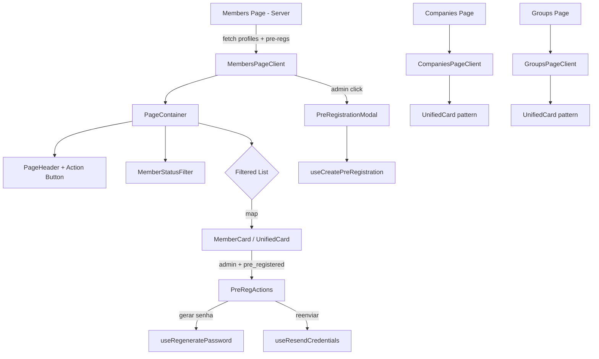

# Confraria Pedra Branca — Brownfield Enhancement Architecture

**Versão:** 2.0
**Data:** 2026-02-18
**Arquiteta:** Aria (@architect)
**Status:** Draft
**Enhancements:** UX Unification + Event RSVP System

---

## 1. Introdução

Este documento define a arquitetura para dois enhancements significativos ao sistema Confraria Pedra Branca:

1. **Enhancement A — UX Unification:** Unificar pré-cadastros na tela de Membros e padronizar a experiência visual em Membros, Empresas e Grupos
2. **Enhancement B — Event RSVP System:** Sistema digital de confirmação de presença em eventos (parcialmente implementado)

**Relação com arquitetura existente:** Este documento suplementa o `brownfield-architecture.md` v1.1, que documenta o sistema base. As decisões aqui respeitam os padrões arquiteturais estabelecidos (Next.js 14 App Router, Supabase, shadcn/ui, React Query).

**PRD de referência:** `docs/prd.md` (UX Unification), `docs/08-STORIES/EPIC-1-EVENT-RSVP-SYSTEM.md` (Event RSVP)

---

## 2. Análise do Projeto Existente

### 2.1 Estado Atual

| Área | Route | Padrão UI | Status |
|------|-------|-----------|--------|
| Dashboard | `/dashboard` | Server component + client stats | Funcional |
| Membros | `/members` | `PageContainer` + lista linear com badges | Funcional |
| Pré-Cadastros | `/admin/pre-registrations` | `PageContainer` + tabela paginada | Funcional (será deprecado) |
| Empresas (admin) | `/admin/companies` | Cards em grid + modals (sem `PageContainer`) | Funcional (precisa padronizar) |
| Empresas (membro) | `/companies` | Cards em grid (sem `PageContainer`) | Funcional (precisa padronizar) |
| Grupos | `/groups` | `PageContainer` + `PageHeader` + grid (padrão mais recente) | Funcional |
| Transações | `/business-transactions` | Client component com tabs | Funcional |
| Eventos (admin) | `/admin/events` | Pages + hooks + modals | Implementado (EPIC-1) |
| RSVP (público) | `/rsvp/[eventId]` | State machine completa | Implementado (EPIC-1) |
| Prospects | `/admin/prospects` | Tabela com filtros + WhatsApp link | Funcional |

### 2.2 Padrões Arquiteturais Identificados

**Server/Client Split Pattern:**
```
page.tsx (Server Component — fetch inicial)
  └── XyzPageClient.tsx (Client Component — interatividade, React Query)
```

**Dois padrões de data fetching coexistentes:**
- **Padrão antigo:** `useEffect` + `fetch()` direto (Members, Companies)
- **Padrão novo:** TanStack React Query hooks (Groups, Events, Pre-Registrations, Transactions)

**Layout primitives estabelecidos:**
- `PageContainer` — Wrapper com padding responsivo (`p-4 sm:p-6`), `max-w-6xl`, `mx-auto`
- `PageHeader` — Título + descrição + ação (botão)
- `EmptyState` — Card com ícone + mensagem + CTA

**Toast duality:**
- shadcn toast (`use-toast.ts`) — páginas antigas
- Sonner — hooks mais recentes

**Naming inconsistency em hooks:**
- `use-kebab-case.ts` (mais recente)
- `useCamelCase.ts` (mais antigo: `useEvents.ts`, `usePreRegistrations.ts`)

### 2.3 Documentação Disponível

- [x] Brownfield Architecture v1.1 (1523 linhas, completo)
- [x] PRD Brownfield v1.0 (UX Unification)
- [x] EPIC-1 Event RSVP System (4 stories, status InProgress)
- [x] Design Refactor Plan (Fase 1 completa, Fases 2-4 pendentes)
- [x] Docs de implementação (Pre-Registration API, Twilio Setup)
- [ ] Testes unitários (ausentes)
- [ ] Documentação de API formal (apenas inline no CLAUDE.md)

### 2.4 Restrições Identificadas

1. **Zero alterações de backend/DB para Enhancement A** — PRD define: APIs e schema intocados
2. **Enhancement B já parcialmente implementado** — APIs, hooks, admin pages e RSVP page existem
3. **RLS com `is_admin()` helper** — Padrão SECURITY DEFINER já estabelecido (evita recursão)
4. **Middleware não protege API routes** — Auth é feita individualmente em cada route handler
5. **`export const dynamic = 'force-dynamic'`** — Obrigatório em pages protegidas
6. **Soft delete pattern** — `deleted_at IS NULL` em todos os filtros

---

## 3. Escopo dos Enhancements e Estratégia de Integração

### 3.1 Enhancement A — UX Unification

| Aspecto | Detalhe |
|---------|---------|
| **Tipo** | Modificação de Feature + UX Overhaul |
| **Escopo** | Frontend only (zero alterações de API/DB) |
| **Impacto** | Moderado — 6 arquivos modificados, 4-6 novos componentes |

**Estratégia de integração:**
- **Código:** Absorver funcionalidade de pré-cadastros na page de Members via composição de componentes
- **Database:** Nenhuma alteração. Queries existentes retornam todos os dados necessários
- **API:** APIs `/api/admin/pre-registrations/*` e `/api/members/*` permanecem intactas. Tela de Members consumirá ambas em paralelo (admin only)
- **UI:** Reutilizar 100% dos hooks e componentes de pré-cadastro existentes

### 3.2 Enhancement B — Event RSVP System

| Aspecto | Detalhe |
|---------|---------|
| **Tipo** | Nova Feature (isolada) |
| **Escopo** | Full-stack: DB + APIs + Frontend |
| **Impacto** | Baixo no sistema existente — tabelas e routes novas, zero conflito |

**Status de implementação (descoberto na análise):**

| Componente | Status | Localização |
|-----------|--------|-------------|
| DB Schema (events, event_confirmations) | Implementado | `supabase/migrations/` |
| RLS Policies | Implementado | Migration |
| API Routes (8 endpoints) | Implementado | `app/api/events/` |
| Zod Schemas | Implementado | `lib/schemas/events.ts` |
| Activity Log Types | Implementado | `lib/activity-log.ts` |
| React Query Hooks | Implementado | `hooks/useEvents.ts` |
| Admin Pages (list, create, edit, detail) | Implementado | `app/(protected)/admin/events/` |
| Admin Components (EventForm, EventActions) | Implementado | `admin/events/components/` |
| Public RSVP Page | Implementado | `app/rsvp/[eventId]/page.tsx` |
| Sidebar Entry | Implementado | `components/Sidebar.tsx` ("Eventos") |

**O que falta para EPIC-1:**
- QA Gate: testes E2E, validação de edge cases
- Alinhamento visual com o padrão unificado (Enhancement A)
- Documentação de API

### 3.3 Requisitos de Compatibilidade

| Requisito | Enhancement A | Enhancement B |
|-----------|--------------|--------------|
| API backward compat | 100% (zero changes) | N/A (APIs novas) |
| DB schema compat | 100% (zero changes) | 100% (tabelas novas apenas) |
| UI/UX consistency | Objetivo principal | Alinhar ao padrão novo |
| Auth/RLS | Mantido | Usa `is_admin()` pattern |
| Performance | < 2s com 500 registros | < 2s com 500+ confirmações |

---

## 4. Alinhamento de Tech Stack

### 4.1 Stack Existente Mantida

| Categoria | Tecnologia | Versão | Uso nos Enhancements |
|-----------|-----------|--------|---------------------|
| Framework | Next.js 14 (App Router) | 14.2.21 | Server/Client components |
| React | React 18 | 18.3.1 | Componentes UI |
| TypeScript | TypeScript | 5.8.3 | Tipagem strict |
| Database | Supabase (PostgreSQL) | 2.58.0 | Queries existentes (A), tabelas novas (B) |
| UI Library | shadcn/ui + Radix UI | Latest | 100% dos novos componentes |
| Styling | Tailwind CSS 3 | 3.4.17 | Utilitários existentes |
| Data Fetching | TanStack React Query | 5.83.0 | Hooks para todas as queries |
| Validation | Zod | 3.25.76 | Schemas existentes |
| Auth | Supabase Auth + SSR | Latest | Sem alterações |
| Icons | Lucide React | 0.462.0 | Ícones de UI |

### 4.2 Novas Tecnologias

**Nenhuma nova tecnologia é necessária.** Ambos os enhancements utilizam 100% da stack existente.

---

## 5. Data Models e Schema Changes

### 5.1 Enhancement A — UX Unification

**Zero alterações de schema.** Tabelas afetadas (somente leitura):

| Tabela | Uso |
|--------|-----|
| `profiles` | Lista de membros (ativos + pré-cadastrados via flag `pre_registered`) |
| `pre_registration_attempts` | Status de pré-cadastro (pending/accessed/expired/locked) |
| `companies` | Listagem de empresas |
| `member_companies` | Junction table N:M |
| `groups` | Listagem de grupos |
| `quotas` | Cotas por grupo |

### 5.2 Enhancement B — Event RSVP System

**Tabelas já criadas (confirmado no codebase):**

```sql
-- events
CREATE TABLE public.events (
  id uuid PRIMARY KEY DEFAULT gen_random_uuid(),
  name text NOT NULL,
  description text,
  date date NOT NULL,
  time time NOT NULL,
  deadline timestamptz NOT NULL,
  confirmation_limit integer NOT NULL DEFAULT 100,
  status text NOT NULL DEFAULT 'active', -- active | cancelled
  created_by uuid REFERENCES profiles(id),
  created_at timestamptz DEFAULT now(),
  updated_at timestamptz DEFAULT now(),
  deleted_at timestamptz
);

-- event_confirmations
CREATE TABLE public.event_confirmations (
  id uuid PRIMARY KEY DEFAULT gen_random_uuid(),
  event_id uuid REFERENCES events(id) ON DELETE CASCADE,
  user_phone text NOT NULL,
  confirmed_count integer NOT NULL DEFAULT 1 CHECK (confirmed_count BETWEEN 1 AND 4),
  confirmed_at timestamptz DEFAULT now(),
  created_at timestamptz DEFAULT now(),
  updated_at timestamptz DEFAULT now(),
  UNIQUE(event_id, user_phone)
);
```

**RLS Policies:** Seguem o padrão `is_admin()` SECURITY DEFINER — admin vê tudo, confirmações públicas via `createAdminClient()` (bypass RLS para validação de phone).

---

## 6. Component Architecture

### 6.1 Enhancement A — Novos Componentes

```
components/
  unified/                          # Componentes do padrão unificado
    UnifiedCard.tsx                 # Card padrão reutilizável para todas as áreas
    StatusFilter.tsx                # Filtro de status genérico (segmented/dropdown)
    index.ts                       # Exports centralizados

app/(protected)/members/
  page.tsx                         # Refatorar: Server component (fetch members + pre-regs)
  MembersPageClient.tsx            # NOVO: Client component unificado
  components/
    MemberCard.tsx                 # Card de membro (usa UnifiedCard)
    MemberStatusFilter.tsx         # Filtro: Todos | Ativos | Pré-Cadastro
    PreRegActions.tsx              # Ações inline de pré-cadastro
    MemberFormModal.tsx            # Modal de edição (existente, portado)

app/(protected)/companies/
  page.tsx                         # Refatorar: Adicionar PageContainer + PageHeader
  CompaniesPageClient.tsx          # Refatorar: Usar UnifiedCard pattern

app/(protected)/groups/
  GroupsPageClient.tsx             # Refatorar: Alinhar card ao UnifiedCard pattern
```

**Diagrama de interação — Enhancement A:**



### 6.2 Enhancement B — Componentes Existentes (já implementados)

| Componente | Localização | Status |
|-----------|-------------|--------|
| `EventForm` | `admin/events/components/EventForm.tsx` | Implementado |
| `EventActions` | `admin/events/components/EventActions.tsx` | Implementado (copy link, WhatsApp share, CSV export) |
| RSVP Page | `app/rsvp/[eventId]/page.tsx` | Implementado (state machine completa) |
| Admin List | `admin/events/page.tsx` | Implementado |
| Admin Detail | `admin/events/[id]/page.tsx` | Implementado |
| Admin Edit | `admin/events/[id]/edit/page.tsx` | Implementado |

**Pendente para Enhancement B:**
- Alinhar pages de eventos ao padrão `PageContainer` + `PageHeader` (se não estiverem usando)
- Verificar se cards de eventos seguem o `UnifiedCard` pattern

---

## 7. API Design e Integração

### 7.1 Enhancement A — Zero APIs Novas

A tela unificada de Members consumirá endpoints existentes em paralelo:

```typescript
// MembersPageClient.tsx (admin)
const { data: members } = useMembers()                    // GET /api/members
const { data: preRegs } = usePreRegistrations({ page, limit })  // GET /api/admin/pre-registrations

// Merge client-side para lista unificada
const unifiedList = useMemo(() => mergeAndSort(members, preRegs), [members, preRegs])
```

**APIs existentes consumidas (sem alteração):**

| Endpoint | Método | Uso |
|----------|--------|-----|
| `/api/members` | GET | Lista de membros ativos |
| `/api/admin/pre-registrations` | GET | Lista de pré-cadastros (admin) |
| `/api/admin/pre-registrations` | POST | Criar novo pré-cadastro |
| `/api/admin/pre-registrations/[id]/regenerate-password` | POST | Regenerar senha |
| `/api/admin/pre-registrations/[id]/resend-credentials` | POST | Reenviar credenciais |

### 7.2 Enhancement B — APIs Já Implementadas

| Endpoint | Método | Auth | Status |
|----------|--------|------|--------|
| `/api/events` | POST | Admin | Implementado |
| `/api/events` | GET | Admin | Implementado |
| `/api/events/[id]` | GET | Public (info) / Admin (full) | Implementado |
| `/api/events/[id]` | PUT | Admin | Implementado |
| `/api/events/[id]` | DELETE | Admin (soft cancel) | Implementado |
| `/api/events/[id]/confirm` | POST | Public + phone validation | Implementado |
| `/api/events/[id]/confirmations` | GET | Admin | Implementado |
| `/api/events/[id]/export` | GET | Admin (CSV) | Implementado |
| `/api/events/[id]/validate-phone` | POST | Public (rate limited) | Implementado |

**Padrão seguido:** Rate limiting, auth check, Zod validation, Supabase operation, activity logging, `apiSuccess()`/`apiError()`.

---

## 8. Source Tree — Integração

### 8.1 Estrutura Existente (áreas afetadas)

```
app/(protected)/
  members/
    page.tsx                        # Será refatorado (Enhancement A)
    [id]/page.tsx                   # Mantido
  companies/
    page.tsx                        # Será refatorado (Enhancement A)
  groups/
    page.tsx                        # Mantido (server)
    GroupsPageClient.tsx            # Será refatorado (Enhancement A)
  admin/
    pre-registrations/page.tsx      # Será deprecado → redirect (Enhancement A)
    events/                         # Já implementado (Enhancement B)
    companies/page.tsx              # Avaliar unificação com /companies (FR7)

components/
  layout/                           # PageContainer, PageHeader, EmptyState ✓
  pre-registrations/                # PreRegistrationModal, Table, Badge ✓
  Sidebar.tsx                       # Remover "Pré-Cadastro" (Enhancement A)
```

### 8.2 Novos Arquivos (Enhancement A)

```
app/(protected)/members/
  ├── page.tsx                      # Refatorado → Server component
  ├── MembersPageClient.tsx         # NOVO → Client component unificado
  └── components/
      ├── MemberCard.tsx            # NOVO → Card padrão de membro
      ├── MemberStatusFilter.tsx    # NOVO → Filtro Todos/Ativos/Pré-Cadastro
      └── PreRegActions.tsx         # NOVO → Ações inline pré-cadastro

components/
  └── unified/                      # NOVO → Componentes do padrão unificado
      ├── UnifiedCard.tsx           # NOVO → Card base reutilizável
      ├── StatusFilter.tsx          # NOVO → Filtro genérico
      └── index.ts                  # NOVO → Exports
```

### 8.3 Diretrizes de Integração

| Aspecto | Padrão |
|---------|--------|
| File naming | `kebab-case.tsx` para novos arquivos |
| Import paths | Aliases `@/components`, `@/lib`, `@/hooks` |
| Folder organization | Componentes feature-specific colocados em `app/.../components/` |
| Shared components | `components/unified/` para o padrão de card reutilizável |
| Exports | Barrel exports via `index.ts` |

---

## 9. Infrastructure e Deploy

### 9.1 Infraestrutura Existente (sem alterações)

| Aspecto | Detalhe |
|---------|---------|
| **Deploy** | Netlify + Vercel (staging: Ver-26, prod: main) |
| **Build** | `npm run build` → `.next/` |
| **CI/CD** | Netlify Plugin auto-deploy on push |
| **DB** | Supabase managed (backups automáticos) |
| **Env Vars** | `SUPABASE_URL`, `SUPABASE_ANON_KEY`, `SERVICE_ROLE_KEY` |

### 9.2 Impacto dos Enhancements

| Enhancement | Infra Changes | Migrations | Env Vars |
|------------|---------------|------------|----------|
| A (UX Unification) | Nenhuma | Nenhuma | Nenhuma |
| B (Event RSVP) | Nenhuma (já deployed) | Já executadas | Nenhuma nova |

### 9.3 Rollback

**Enhancement A:** Git revert dos commits de refatoração. Sem migrations = sem rollback de DB.

**Enhancement B:** Já implementado. Se necessário remover: drop tables `events` + `event_confirmations`, remover routes e pages. Sem impacto no sistema existente.

---

## 10. Coding Standards e Convenções

### 10.1 Padrões Existentes a Seguir

| Padrão | Detalhe |
|--------|---------|
| **TypeScript strict** | Sem `any`, tipagem explícita |
| **Server/Client split** | Server Component para fetch, Client Component para interatividade |
| **React Query hooks** | Padrão para todos os novos data fetching (não usar `useEffect` + `fetch`) |
| **Zod validation** | Client-side e server-side |
| **`apiSuccess()`/`apiError()`** | Para todas as respostas de API |
| **`logActivity()`** | Fire-and-forget em todas as operações |
| **Rate limiting** | Em endpoints públicos |
| **Soft delete** | `deleted_at` em vez de DELETE físico |
| **`cn()` utility** | Para composição de classes Tailwind |
| **UI em pt-BR** | Todo texto visível ao usuário em português |
| **Código em inglês** | Variáveis, funções, commits |

### 10.2 Regras de Integração Críticas

| Regra | Detalhe |
|-------|---------|
| **API Compatibility** | APIs existentes NÃO podem ter breaking changes |
| **DB Integration** | Enhancement A: zero queries novas. Enhancement B: tabelas isoladas |
| **Error Handling** | Try/catch + toast (sonner para novos hooks) |
| **Logging** | Activity types já definidos para events em `lib/activity-log.ts` |

### 10.3 Decisão Arquitetural: Padronizar em React Query

**Problema:** Members e Companies usam `useEffect` + `fetch()` direto. Todas as outras áreas usam React Query.

**Decisão:** Novos componentes de Members (`MembersPageClient`) DEVEM usar React Query hooks (`useMembers`, `usePreRegistrations`). A refatoração de Companies DEVE migrar para React Query.

**Justificativa:** Consistência, cache automático, invalidação declarativa, retry built-in.

---

## 11. Testing Strategy

### 11.1 Testes Existentes

| Tipo | Framework | Status |
|------|-----------|--------|
| E2E | Playwright | Configurado, testes básicos em `e2e/` |
| Unit | — | **Ausente** (dívida técnica) |
| API | Playwright (E2E) | Resilient to DB offline |

### 11.2 Testes para Enhancement A

| Tipo | Escopo | Prioridade |
|------|--------|------------|
| E2E | Lista unificada exibe members + pre-regs | Alta |
| E2E | Filtro de status funciona (Todos/Ativos/Pré-Cadastro) | Alta |
| E2E | Ações de pré-cadastro funcionam inline | Alta |
| E2E | Redirect `/admin/pre-registrations` → `/members?status=pre-cadastro` | Média |
| E2E | Companies e Groups seguem padrão visual | Média |
| Regression | APIs `/api/members` e `/api/admin/pre-registrations` sem alteração | Alta |

### 11.3 Testes para Enhancement B

| Tipo | Escopo | Prioridade |
|------|--------|------------|
| E2E | Full flow: admin cria → user confirma → admin vê | Alta |
| E2E | Edge cases: deadline passada, evento cancelado, número inválido | Alta |
| E2E | Export CSV com dados corretos | Média |
| E2E | Rate limiting no endpoint público | Média |
| Performance | Dashboard com 1000+ confirmações | Média |

---

## 12. Security Integration

### 12.1 Medidas de Segurança Existentes

| Medida | Implementação |
|--------|--------------|
| **Auth** | Supabase Auth (JWT), middleware valida `getUser()` |
| **Authorization** | `profiles.role` check em cada API route |
| **RLS** | PostgreSQL RLS em todas as tabelas, `is_admin()` SECURITY DEFINER |
| **Rate Limiting** | In-memory por IP/route |
| **Input Validation** | Zod schemas server-side |
| **Soft Delete** | `deleted_at` preserva dados |
| **Password Hashing** | bcrypt (salt 12) |

### 12.2 Requisitos de Segurança por Enhancement

**Enhancement A:**
- **CR4:** Membros (role `member`) NÃO podem ver dados de pré-cadastro. RLS protege em nível de DB; frontend deve esconder filtro de status e ações de pré-cadastro para o role `member`
- **Verificação:** Hook `useAdmin()` controla visibilidade de UI admin

**Enhancement B (já implementado):**
- Rate limit: 10 confirmações/min por IP, 20 validações/min por IP
- Phone validation: `createAdminClient()` para bypass RLS (necessário para validar phone público contra profiles)
- Upsert pattern: previne confirmações duplicadas via constraint UNIQUE
- Soft cancel: `DELETE` apenas marca `status: 'cancelled'` + `deleted_at`

---

## 13. Checklist de Arquitetura

### Enhancement A — UX Unification

- [x] PRD completo e aprovado (`docs/prd.md`)
- [x] Technical spike validou portabilidade de hooks/componentes
- [x] Zero alterações de API/DB
- [x] Componentes layout base criados (PageContainer, PageHeader, EmptyState)
- [x] Badge `warning` variant já existe
- [ ] `UnifiedCard` component definido
- [ ] `MemberStatusFilter` component definido
- [ ] Migration plan para React Query nos Members
- [ ] Redirect de `/admin/pre-registrations` definido
- [ ] Sidebar update definido

### Enhancement B — Event RSVP System

- [x] Schema DB implementado
- [x] RLS policies implementadas
- [x] 9 API endpoints implementados (8 originais + validate-phone)
- [x] Zod schemas implementados
- [x] Activity log types implementados
- [x] React Query hooks implementados
- [x] Admin pages implementadas (list, create, edit, detail)
- [x] Public RSVP page implementada
- [x] Sidebar entry adicionada
- [ ] Testes E2E
- [ ] Alinhamento visual ao padrão unificado
- [ ] QA Gate final

---

## 14. Próximos Passos

### 14.1 Handoff para Story Manager (@sm)

**Enhancement A — Stories do PRD:**

| Story | Título | Dependências | Escopo |
|-------|--------|-------------|--------|
| 1.1 | Fundação — Padrão de Card e Componentes Base | Nenhuma | `UnifiedCard`, `StatusFilter`, variantes de badge |
| 1.2 | Membros — Unificar Pré-Cadastros | 1.1 | `MembersPageClient`, filtro, ações inline, reconciliar senhas |
| 1.3 | Empresas — Padronizar UX | 1.1 | `PageContainer` + `PageHeader` + `UnifiedCard` |
| 1.4 | Grupos — Padronizar UX | 1.1 | Alinhar cards ao `UnifiedCard` pattern |
| 1.5 | Cleanup — Sidebar, Redirects, Depreciação | 1.2 | Remover sidebar item, redirect, testes E2E |

**Enhancement B — QA e finalização:**

| Story | Título | Dependências | Escopo |
|-------|--------|-------------|--------|
| 1.1-1.4 (EPIC-1) | Status InProgress | Schema + APIs implementadas | QA Gate, testes E2E, edge cases |

### 14.2 Handoff para Developer (@dev)

**Decisões técnicas chave:**

1. **React Query obrigatório** — Usar `useMembers` hook (já existe) em vez de `useEffect` + `fetch` na refatoração de Members
2. **`UnifiedCard` como base** — Componente composable que recebe `title`, `badges`, `info`, `actions` como props
3. **Filtro client-side** — Merge de duas queries (members + pre-regs) no client, filtrado por `useMemo`
4. **Duas requisições paralelas** — Aceitável para < 200 membros + < 50 pré-cadastros
5. **Sonner para toasts** — Padronizar em sonner para todos os novos hooks
6. **Prioridade:** Enhancement A primeiro (Stories 1.1 → 1.5), depois QA de Enhancement B

**Ordem de implementação recomendada:**
```
Story 1.1 (Fundação)
  ├──→ Story 1.2 (Members + Pré-Cadastro) ──→ Story 1.5 (Cleanup)
  ├──→ Story 1.3 (Empresas) ─── paralelo
  └──→ Story 1.4 (Grupos) ──── paralelo
         │
         └──→ QA Gate EPIC-1 (Events) ── após padrão visual estabilizado
```

---

## Histórico de Mudanças

| Mudança | Data | Versão | Descrição | Autor |
|---------|------|--------|-----------|-------|
| Documento criado | 2026-02-18 | 2.0 | Arquitetura brownfield para UX Unification + Event RSVP | Aria (@architect) |

---

— Aria, arquitetando o futuro 🏗️
